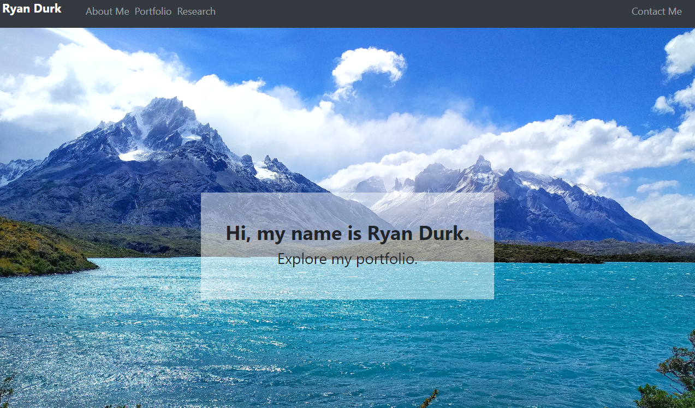

<!-- React Portfolio -->

  <h3 align="center">My React Portfolio</h3>

  

    Come check out a portfolio I made using react.
     
    <a href="https://rpdurk-react-portfolio.herokuapp.com/"><strong>Link to Live Portfolio»</strong></a>
     
  

<!-- TABLE OF CONTENTS -->
## Table of Contents

* [About the Project](#about-the-project)
  * [Built With](#built-with)
* [Visit the Site](#visitTheSite)
* [Usage](#usage)
* [Contributing](#contributing)
* [License](#license)
* [Contact](#contact)

<!-- ABOUT THE PROJECT -->
## About The Project

[React Portfolio](https://rpdurk-react-portfolio.herokuapp.com/)

This is a portfolio of my work created with React and hosted on Heroku.

### Built With
* [JavaScript](https://www.javascript.com/)
* [heroku](https://www.heroku.com/home)
* [React Bootstrap](https://react-bootstrap.github.io/)

## Visit The Site

Visit the live website at [Here](https://rpdurk-react-portfolio.herokuapp.com/)

## Usage

The primary purpose of this is to showcase my web development work.

1. Home Page
    

## Contributing

Contributions for this web application was made by 
* [Ryan Durk](https://github.com/rpdurk)

<!-- LICENSE -->
## License

MIT License
